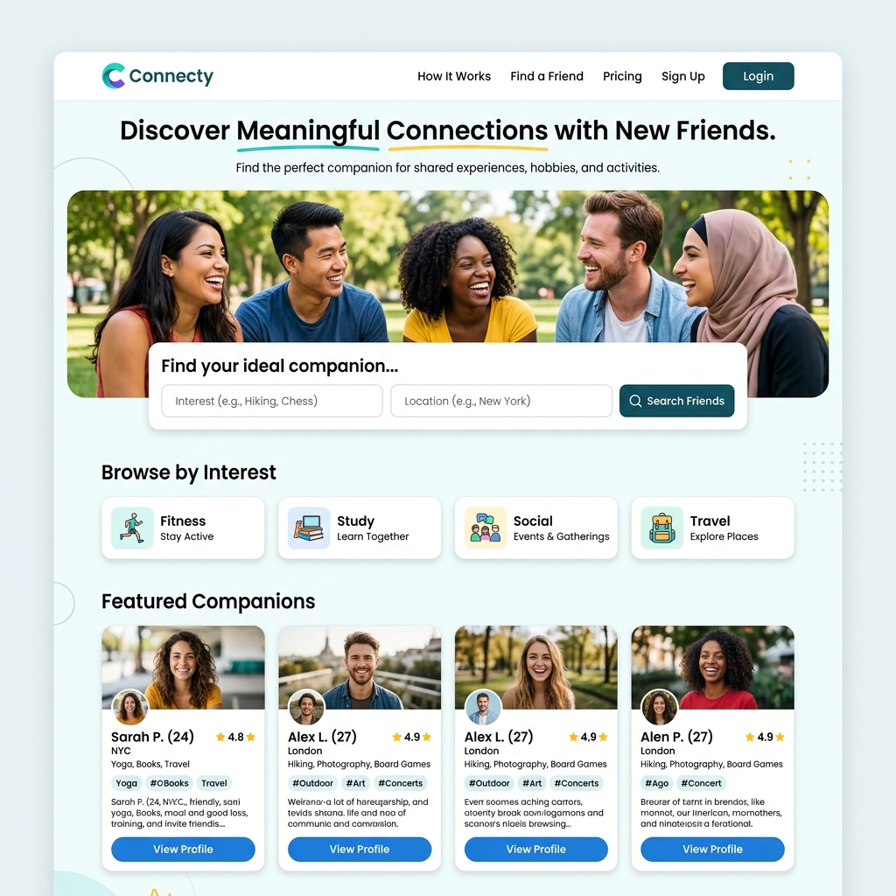
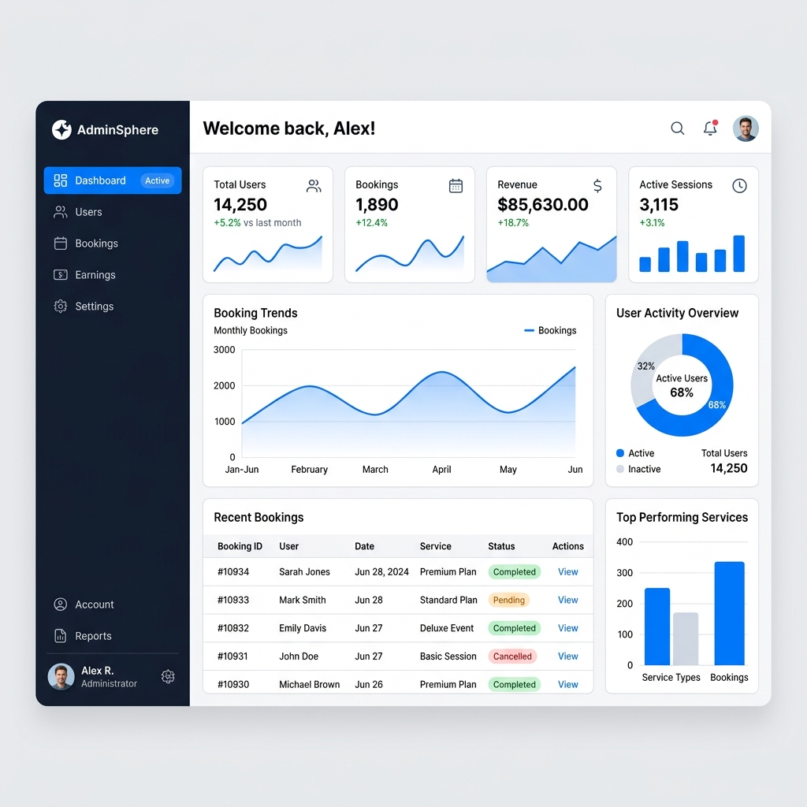

# Hire-a-Friend Platform

A comprehensive platform where users can discover and hire companions for various activities like fitness, studying, social events, and travel.

## Screenshots

### Home Page

### Admin Dashboard

## Features

- **User & Partner Profiles**: Distinct dashboards for customers, companion partners, and enterprise admins.
- **Advanced Search & Filtering**: Find the perfect companion by category, location, and interests.
- **Booking & Scheduling**: Seamlessly book time with companions and manage availability.
- **Real-time Chat**: Built-in messaging system for communication between users and companions.
- **Payment & Earnings**: Secure payment processing, wallet system, and commission tracking.
- **Admin Management**: Complete oversight with KYC verification, user management, and analytics.

## Setup Instructions

1. Clone the repository.
2. Run `composer install` and `npm install`.
3. Copy `.env.example` to `.env` and configure your database settings.
4. Run `php artisan key:generate`.
5. Run `php artisan migrate --seed` to populate the database with initial data.
6. Run `npm run dev` and `php artisan serve` to start the application.

## License

This project is open-sourced software.
